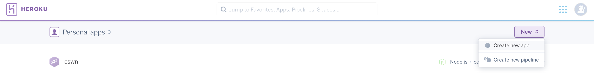
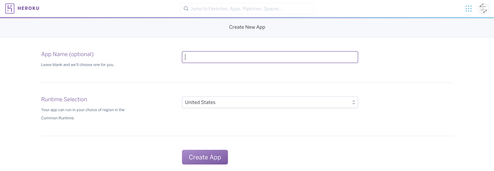
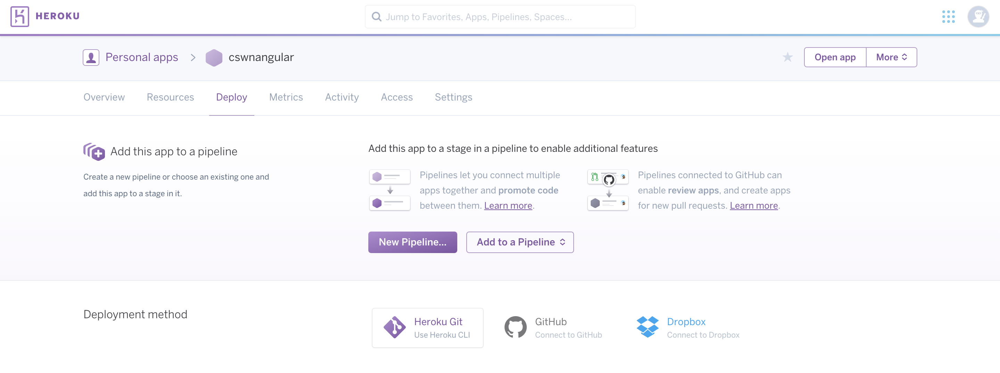
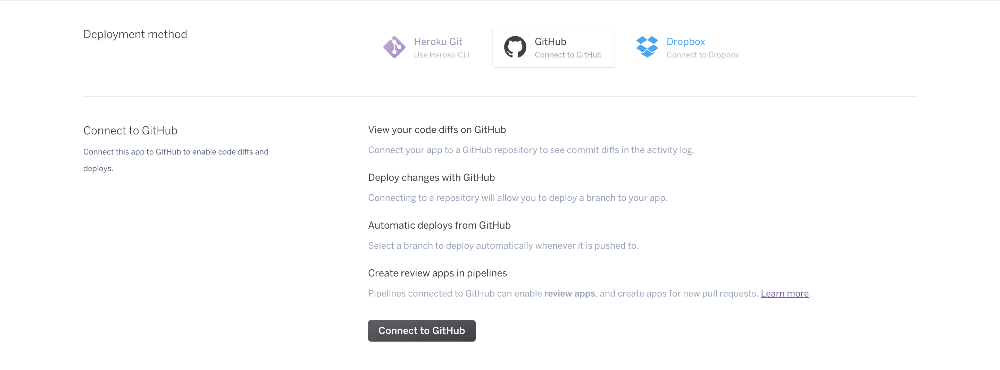
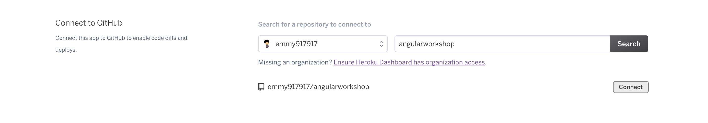
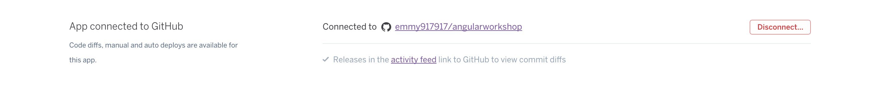
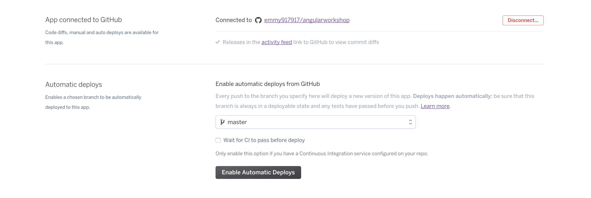

# Extra:  Deploy With Heroku

The current version of the application is only available locally.  If you'd like employers to be able to see your fantastic webapp, you'll need to deploy it another way.  One way to do so is to use Heroku.  

Create an account for Heroku.  Heroku is found here:  [Link](https://www.heroku.com/)

Now, we will need to link Github to your Heroku account.
1. Once you create you Heroku app, go ahead and create a new app by clicking on "New" and "Create new app" from the dropdown.
2. Give the app a name, or you can let Heroku make one up for you
3. Go to your new app and click on "Deploy"
4. Click on "Github" option under Deployment method and it should load another section called "Connect to Github." Click on the "Connect to Github" button. If you're already logged into you Github account, Heroku will automatically find your username!
5. Almost there! Next, add the name of the repo you want to connect (for this tutorial, it would be "angularworkshop"). The name MUST match the name of the repo, otherwise Heroku won't be able to find your repo! Click on the "connect" button next to the repo.
Great! Now it should look like this: 
6. Next, set up Heroku to deploy from the branch you're currently on, which is most likely named master. Go ahead and click on "Enable Automatic Deploys." Now everytime you push to your Github master branch, the new code will be updated to your Heroku app! 
7. Now you can view your app via nameofyourherokuapp.herokuapp.com (So if you named your Heroku app "ctrlaltdelete," the url to view it is `ctrlaltdelete.herokuapp.com`).