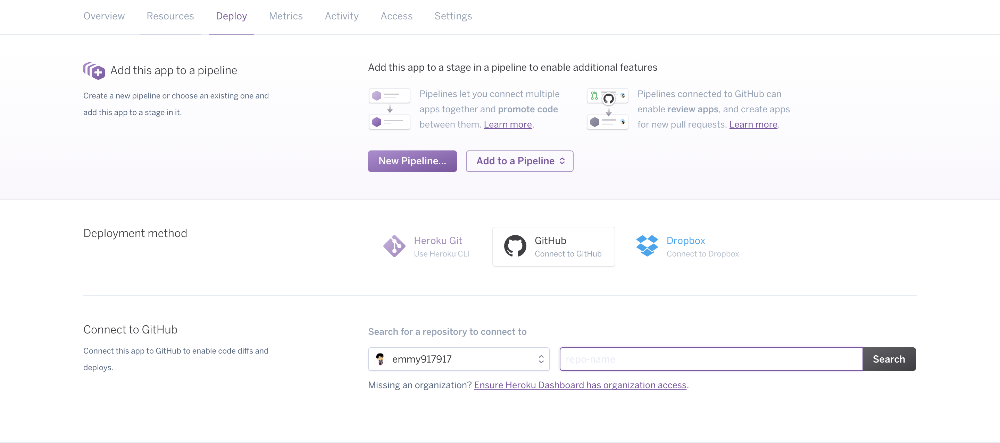

# Extra:  Deploy With Heroku

The current version of the application is only available locally.  If you'd like employers to be able to see your fantastic webapp, you'll need to deploy it another way.  One way to do so is to use Heroku.  

Create an account for Heroku.  Heroku is found here:  [Link](https://www.heroku.com/)

Now, we will need to link Github to your Heroku account.
1. Once you create you Heroku app, go ahead and create a new app by clicking on "New" and "Create new app" from the dropdown.
2. Go to your new app and click on "Deploy"
3. Click on "Github" option under Deployment method and it should load another section called Connect to Github:
4. Under "Connect to Github" add your 

Next, set up Heroku to deploy from the branch you're currently on, which is most likely named master.  Instructions for that can be found here:  [Click Here](https://developer.github.com/guides/automating-deployments-to-integrators/)